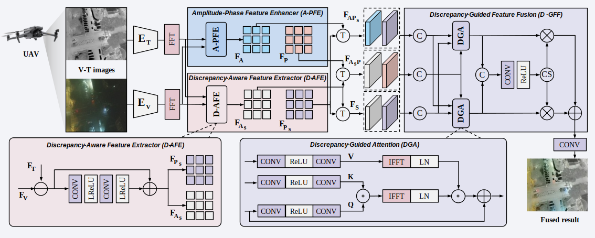
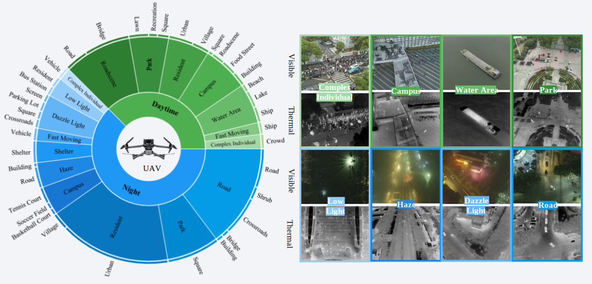

# DGFusion: Discrepancy-Guided Network for Aerial Visible-Thermal Image Fusion

Changhong Fu, Xiang Huang, Zijie Zhang, Haobo Zuo, Yongkang Cao, Shenghao Ren



## <a name="abstract"></a>📎 Abstract
>Visible-thermal image fusion is vital for unmanned aerial vehicle to achieve intelligent applications. However, existing fusion methods mainly rely on extracted inherent modality features without explicit attention to cross-modality discrepancies and effective feature enhancement mechanisms, critically limiting fusion performance. To address these issues, a novel discrepancy-guided visible-thermal image fusion (DGFusion) is introduced for UAV. Specifically, a dedicated amplitude-phase feature enhancer is introduced, augmenting inherent modality features in order to reinforce global information while preserving local clarity. Additionally, an innovative discrepancy-aware feature extractor is presented to highlight critical modality-discrepancy cues while filtering out irrelevant noise. Besides, an adaptive discrepancy-guided feature fusion is proposed to integrate both enhanced and discrepant features, enabling stable fusion results under dynamic UAV conditions. A new dataset comprising 8700 pairs of visible-thermal images captured from a UAV perspective and covering diverse challenging scenarios is established to evaluate the effectiveness of the proposed fusion method. Extensive experiments demonstrate that DGFusion outperforms state-of-the-art methods in terms of both fusion quality and robust performance.

## <a name="Benchmark"></a> 🌈 Benchmark
The benchmark encompasses 8,700 aligned visible-thermal image pairs, of which 6,393 pairs are designated for training and 2,307 pairs for testing. You can download the benchmark from [Google Drive]((https://drive.google.com/drive/folders/1x_47Vsu_DeYh_ki8FK8shkp1m3KK8ylV?usp=drive_link)) or [Baidu](https://pan.baidu.com/s/1mUgeZs0wf1K2kAVQCRlSxg?pwd=ivnd).


## 🚀 : How to train

1. Run `VSM.m` to generate saliency maps for dataset.

2. Update the paths of image sets in the training configuration.

    ```bash
    Updating the paths in configure files of /options/train/DGFusion.yml
    ```

3. Run the training commands.

    ```bash
    python train.py -opt /SHIP/options/train/DGFusion.yml
    ```

---

## 🚀 : How to test

1. Download the pretrained model from [Google Drive](https://drive.google.com/drive/folders/1x_47Vsu_DeYh_ki8FK8shkp1m3KK8ylV?usp=drive_link) or [Baidu]([https://pan.baidu.com/s/1mUgeZs0wf1K2kAVQCRlSxg?pwd=ivnd](https://pan.baidu.com/s/1akrP2ymDDNRUCzVqcad9Mg?pwd=stdd )) and put it in the `pretrained_model` folder.

2. Update the paths of image sets and pretrained models.

    ```bash
    Updating the paths in configure files of /options/test/DGFusion.yml
    ```

3. Run the testing commands.

    ```bash
    python test.py -opt /options/test/DGFusion.yml
    ```

## <a name="Performance"></a> 😀 Performance
Compared to other methods, DGFusion effectively preserves structural details from the visible modality while enhancing salient thermal targets, leading to more informative and visually balanced results under various challenging conditions.


# Acknowledgement
The code is implemented based on [SHIP](https://github.com/zheng980629/SHIP). We would like to express our sincere thanks to the contributors.

